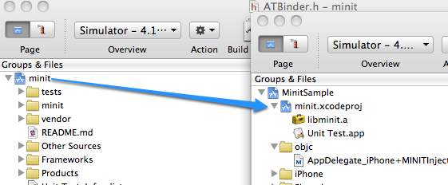
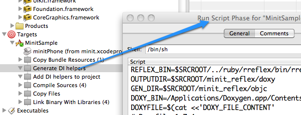
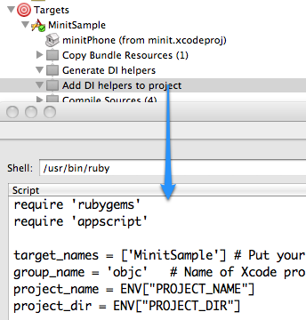

MINIT - Objective-C Dependency Injection
========================================

MINIT is Objective-C Dependency Injection library inspired by Google Guice.

References:

* [Dependency Injection Design patterns using Spring and Guice](http://www.manning.com/prasanna/)
* [Google Guice](http://code.google.com/p/google-guice/)

*Note: MINIT works with XCode 3. Support for XCode 4 will follow.*

How MINIT works?
----------------

MINIT is a static library which is included in client projects. It uses code 
generation to add reflexion capabilities and code annotation support to objective-c.
Internally it uses DOXYGEN to analyze the project and to generate runtime available
meta data.

Overview
--------

Each of the features shown in the following sub sections can be seen and 
tested in the MinitSample project. See the *Sample project* section bellow on 
how it works. MinitSample is a iphone project but it MINIT is not, meaning that
MINIT should work with a non iPhone project.

### Module configuration

DI configuration is loaded in to MINIT from a module. 

    @interface MinitSampleModule : ATModule {
    }
    @end
    @implementation MinitSampleModule

    -(void) configure{
      [self bind:[NSString class] named:@"MainWindow" toInstance:@"MainWindow_iPhone"];
    }
    @end

At bootstrap time MINIT accepts a list of modules with configuration information.

    NSArray *modules = [NSArray arrayWithObject:[MinitSampleModule class]];

### Initializer parameters

Initializer parameters types are extracted from initializer declaration. In 
addition extra metadata can be specified using annotations. In the following
example @@InjectNamed(MainWindow) annotation tells MINIT to use a binding named
MainWindow for xibName parameter.

    /**
     * @param xibName @@InjectNamed(MainWindow)
     */
    -(id) initWithXibName:(NSString *) xibName;

### DI bootstrap

The solution I have chosen is to inject my own AppDelegate, built and wired
by MINIT. 

There are multiple steps involved in this kind of bootstrapping. 

* first of all AppDelegate should be removed from main xib
* in the main xib the file owner should be the AppDelegate
* in main.c

    `int main(int argc, char *argv[]) {
        NSAutoreleasePool * pool = [[NSAutoreleasePool alloc] init];
        int retVal = UIApplicationMain(argc, argv, @"UIApplication", @"AppDelegate_iPhone");
        [pool release];
        return retVal;
    }`
* in AppDelegate_Iphone.m

    `-(id) init{
      [self release];
      NSArray *modules = [NSArray arrayWithObject:[MinitSampleModule class]];
      ATInjector *i = [ATInjector injectorWithModules:modules];
      return [[i instanceOf:[AppDelegate_iPhone class]] retain];
    }`

This basically means that AppDelegate's init will replace self with with an 
instance obtained from the DI library.

Sample project
--------------

MinitSample it is a ready to use sample project. It needs minimal setup and shows
MINIT's main features.

In the next sections I will show you how the SampleProjects uses MINIT to function.

### Doxygen

[Doxygen][1] needs to be installed on the development systems. The universal binary
for Mac OS X can be downloaded from [Doxygen download page][2]. After installation
it can be found in /Applications/Doxygen . If it is installed in a another location
additional set-up needs to be done in order to tell MINIT where to find it.

    [adi@mpro] ~ $ ls /Applications/Doxygen.app/Contents/Resources/doxygen
    /Applications/Doxygen.app/Contents/Resources/doxygen

### Ruby 

I will not cover how to install Ruby on OS X. I can tell you that MINIT was tested
with ruby 1.8.7.

### appscript

Ruby [appscript][3] (rb-appscript) is a high-level, user-friendly Apple event 
bridge that allows you to control scriptable Mac OS X applications using 
ordinary Ruby scripts.

Follow on site install guide for the setup. Usually it is as easy as 
`sudo gem install rb-appscript` Here it is how it looks on my system:

    [adi@mpro] ~ $ gem list --local|grep 'rb-appscript'
    rb-appscript (0.6.1)

### MINIT is a subproject of MinitSample

Notice how MINIT is used as a sub project in the client project. This is easily 
done in XCode by having the two projects open side by side and dragging MINIT 
to client project.
By using this setup means that when MinitSample is build, MINIT is also build if
needed. 

In a normal situation it libminit.a can be included in the project instead.

### DOXYGEN and code generation

As a first step of code generation DOXYGEN is invoked in a run script build phase.
You can see that on Targets->MinitSample->Generate DI helpers (right click ) ->Get Info.

 

DOXYGEN generates it's output as XML which is then parsed in to objective-c code. 
At this stage it parses only header files and generates one output objective-c 
file per input header file.

At this moment there is minimal error handling at this stage. You should survey 
your build output and deal with errors or warnings. When it detects a problem,
MINIT generates a warning which is displayed in the build output. It may also 
fail the build in case of more serious problems.

### Injection helpers are added to project

In the next step another build phase run script adds all generated files to
the current project and to main target.
You can see that on Targets->MinitSample->Add DI helpers to project(right click )->Get Info.

 

[1]: http://www.doxygen.org/ "Doxygen homepage"
[2]: http://www.stack.nl/~dimitri/doxygen/download.html#latestsrc "Doxygen download"
[3]: http://appscript.sourceforge.net/rb-appscript/index.html "Ruby appscript (rb-appscript) "